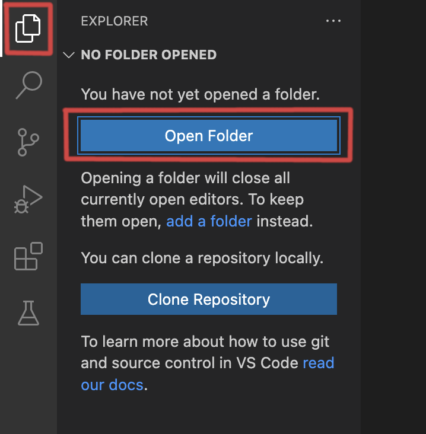
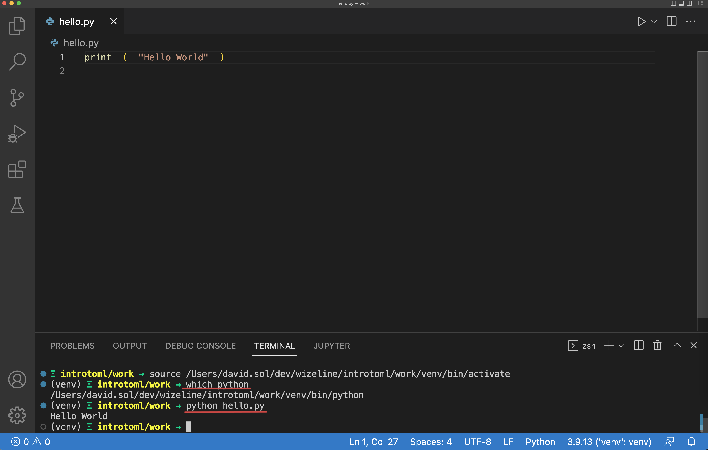
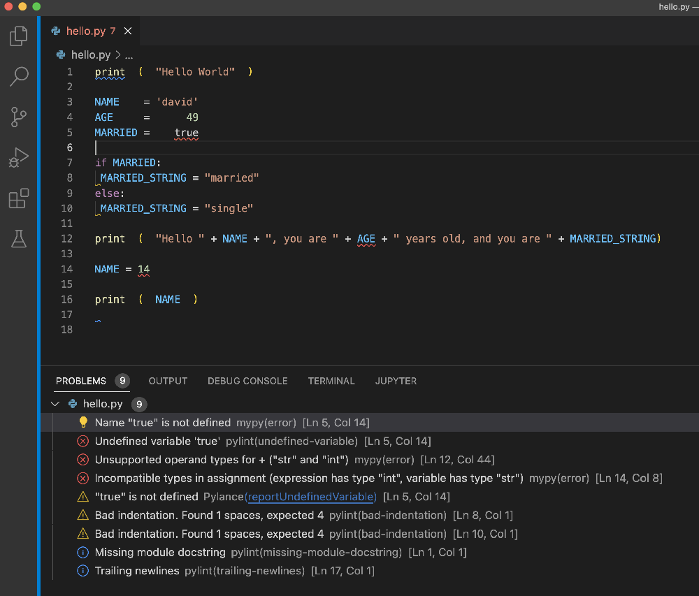
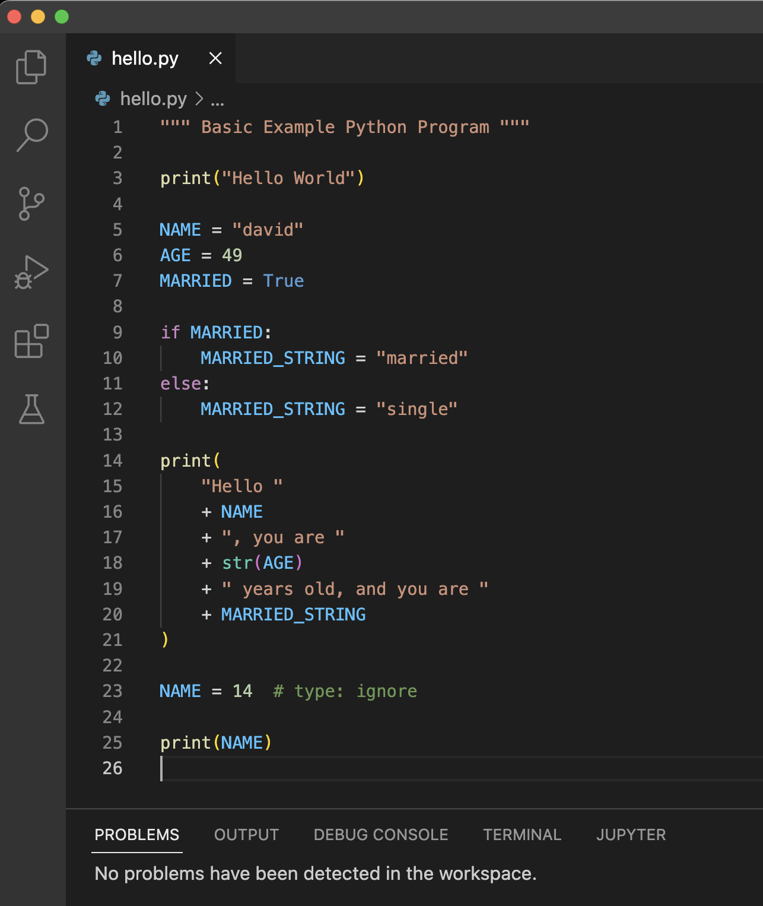
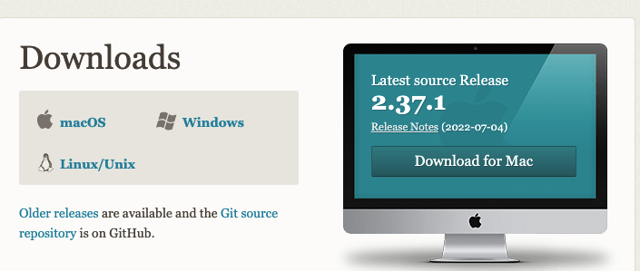
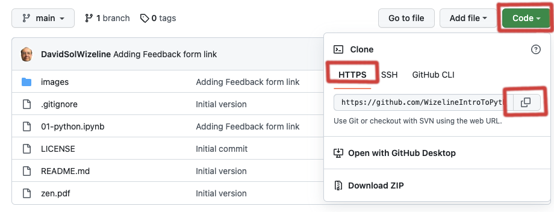
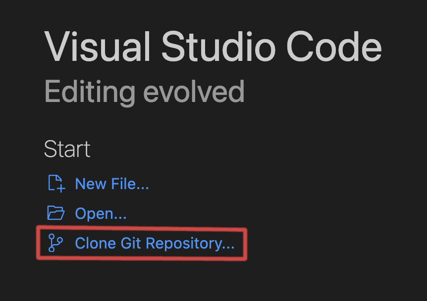

# Session 03

## IDEs and GIT


## "The Big Short" Discussion


## Article Discussion

[We Can Protect the Economy From Pandemics. Why Didn't We?](https://www.wired.com/story/nathan-wolfe-global-economic-fallout-pandemic-insurance/)


## IDEs

**Integrated Development Environment**: An application that helps you develop software.

### Spyder

[Link](https://www.spyder-ide.org)

> 

### Jetbrains PyCharm

[Link](https://www.jetbrains.com/pycharm/)

> 

### Microsoft Visual Studio Code

[Link](https://code.visualstudio.com)

> 

Visual Studio Code is just a **Text Editor**, but it allows **extensions** to be added to it so it can become a fully-fledged IDE, for many languages and use cases.

It is free, easy to install and learn, very extensible and has great support.

### Installing Visual Studio Code

If you are on MacOS with **brew**, execute in the terminal:

```bash
brew install --cask visual-studio-code
```

If not **download** the corresponding installer from [HERE](https://code.visualstudio.com/Download) and **execute** it.

**Open** the installed Visual Studio Code.

Right now it only has the most basic IDE functionality (for basic Web Development, HTML, CSS and Javascript). We need to **add the functionality for Python**.

In the side bar select the **Extensions** page and install the **IntelliCode** and **Python** extensions. The Python extension automatically installs other 4 extensions.


Then we go to the Explorer Page and choose **"Open Folder"**, select the folder where we had created the virtual environment the last session.



Create a new file and name it `helloworld.py` (to create a new file you can use Cmd-n or Win-n, and to save it use Cmd-S or Win-s). In the file write the following Python code (including the spaces around the parentesis):

```python
print  (  "Hello World"  )
```

Notice that in the bottom right part of the screen Visual Studio Code has already identified our Python Virtual Environment.


We can open an **Integrated Terminal** within Visual Studio Code and execute our code there, in the **View -> Terminal** menu option.



Notice how Visual Studio Code automatically starts our Virtual Environment inside the Terminal session.

We can also run the code using the ▶️ button in the top of the screen.

Now modify the `hello.py` Python program so it ends like this (include the spaces and indents):

```python
print  (  "Hello World"  )

NAME    = 'david'
AGE     =      49
MARRIED =    true

if MARRIED:
 MARRIED_STRING = "married"
else:
 MARRIED_STRING = "single"

print  (  "Hello " + NAME + ", you are " + AGE + " years old, and you are " + MARRIED_STRING)

NAME = 14

print  (  NAME  )
```

As soon as we type the code we get a warning, with squiggly lines under the `true` word and a **(1)** showing in the "PROBLEMS" tab in the bottom. Visual Studio Code is informing us that `true` is not a recognized identifier, as it should be `True`, staring with an uppercase letter. After you change it the warnings should go away.

Even so, if you run the code it will fail as you cannot concatenate an integer (`AGE`) with string values.

```text
TypeError: can only concatenate str (not "int") to str
```

### Improving our Python developer experience

Even if Python has "shortcomings", we can use tooling, both as modules and within Visual Studio Code, to improve our Developer Experience, and improve our productivity.

We need to install three packages for this. Instead of installing them one at at time we are going to create a Python `requirements` file.

Create a new file called `requirements.txt` with the following content.

```
black
mypy
pylint
```

Those are the names of modules we are going to install:

- [black](https://github.com/psf/black) : Code Formatter.
- [mypy](http://mypy-lang.org) : Static Type Checker.
- [pylint](https://pylint.pycqa.org/en/latest/) : Static Code Analyser.

First we update pip to have the latest version.

```bash
python -m pip install -U pip
```

And then we install all the packages in the `requirements.txt` file. Note: In real projects the `requirements.txt` file (or another similar technique) is used to manage the version of the packages too.

```bash
python -m pip install -r requirements.txt
```

Once the modules are installed in our virtual environment we activate their use in Visual Studio Code. Open the **`View -> Command Palette...`** menu option and looks for the `Preferences: Open Workspace Settings (JSON)` command.

In the `settings.json` file that gets opened write:

```json
{
    "editor.formatOnSave": true,
    "python.formatting.provider": "black",
    "python.linting.enabled": true,
    "python.linting.mypyEnabled": true,
    "python.linting.pylintEnabled": true
}
```

As soon as we activate Black, MyPy and PyLint we see a lot of recommendations in our code.



After we "fix" (or choose to ignore) the warnings, and save the code, should end like this:

```python
""" Basic Example Python Program """

print("Hello World")

NAME = "david"
AGE = 49
MARRIED = True

if MARRIED:
    MARRIED_STRING = "married"
else:
    MARRIED_STRING = "single"

print(
    "Hello "
    + NAME
    + ", you are "
    + str(AGE)
    + " years old, and you are "
    + MARRIED_STRING
)

NAME = 14  # type: ignore

print(NAME)
```



As we can see, using an IDE witht he right modules and configuration we can mitigate most of the limitations of Python and improve our Developer Experience and productivity.

## Git

> Git is a free and open source distributed version control system designed to handle everything from small to very large projects with speed and efficiency.

Webpage: <https://git-scm.com>


Git was originally made by **[Linus Torvalds](https://en.wikipedia.org/wiki/Linus_Torvalds)**, who also originally made **Linux**


Git is a very **versatile** tool for our code.

- **Store** and manage.
- **Version** and document.
- **Share** and work as a team.
- **Automate** processes.

You could think about Git as a Time Machine.

First we need to check if git is already installed, in a Terminal (you can use Visual Studio Code integrated terminal):

```bash
git --version
```

If it responds something like the following, it means Git is installed and we can start using it.

```text
git version 2.37.1
```

On the other hand, if it shows an error, we need to install it.

In MacOS with **Brew** type in the terminal:

```bash
brew install git
```

Else, download and install it from [HERE](https://git-scm.com/downloads).



After it is installed open a new terminal (or Visual Studio Code Integrated Terminal) and do again:

```bash
git --version
```

## GitHub - Git in the Cloud

> GitHub is a code hosting platform for version control and collaboration. It lets you and others work together on projects from anywhere.

Webpage: <https://github.com>

We will **Clone** the code of the first session. Open the webpage of the Session 01 **repository**.

<https://github.com/WizelineIntroToPythonML/01-python>

In that page we can find the HTTPS URL to clone the code:



```url
https://github.com/WizelineIntroToPythonML/01-python.git
```

With that URL we can clone the repository code in our computer.

Close your current Workspace in Visual Studio Code selecting the Menu option ```File -> Close Folder```.

In the welcome screen select ```Clone Git Repository...```



It will ask for the Repository to open, so we copy `https://github.com/WizelineIntroToPythonML/01-python.git` there:


Finally it ask us for the Path where the repository is going to be cloned. Git will create a new folder with the repository name (`01-python`) under that folder. Choose the work directory we created.

When it finishes to clone the repository it asks us if we want to open the code, and we say yes.

We learned how to clone a repository!

## Feedback


Please helps us filling up the **[Feedback Form](https://docs.google.com/forms/d/e/1FAIpQLSf-yrrCkg66KFFimIk62me8jkSybb9wY1tdqhuRNKG1pchk5w/viewform)**.

## Next session

We will go deeper on Jupyter Notebooks and Markdown.

**Homework:**

No homework!
